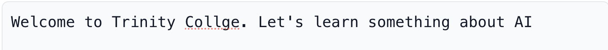
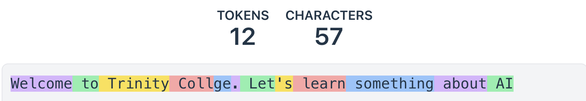

<style src="./style.css"></style>

<div class="kicker">Trinity College · September 14, 2026</div>

# AI Integration

<div class="big">Your first coding agent</div>

Ken Kousen · CPSC 415<br>Monday 1:30–4:10 · MC-225

<!--
1:30. Welcome. Laptop and charger are enough; installation happens together.
Open the course Week 1 landing page in a browser before projecting.
This deck supports a lab session, not 160 minutes of lecture.
-->

---
layout: center
---

<div class="kicker">Live demonstration</div>

# An idea becomes something you can use

<div class="prompt">Help me memorize a text.<br>One line at a time.<br>A Next button.<br>Start over after the last line.</div>

<div class="statement">Watch the files change. Then try the result.</div>

<!--
1:32–1:39. Use a fresh scratch directory with lyrics.txt. Launch via orclaude
with the rehearsed model. Use the lab's first prompt. Show the short plan,
approve it, open index.html, and advance through several lines.
Do not wait through more than two minutes of a stalled response. The private
demo-fallback.html is copied from the public book example; label it as a
prepared example, not a result generated live. No /design needed.
Source: book Chapter 2 and public companion lyrics-trainer/ch02-first-doghouse.
-->

---

# What you bring to the work

<div class="two">
<div>

## The agent

Reads files<br>Writes code<br>Runs available tools<br>Proposes changes

</div>
<div>

## You

Define the outcome<br>Choose and refine<br>Check what happened<br>Explain the result

</div>
</div>

<div class="statement">A working page is the beginning of the conversation.</div>

<!--
1:39–1:42. Students know some Python and Java. OOP experience varies.
We will introduce concepts when needed; syntax is something the agent helps
with, not an excuse to accept code nobody understands.
-->

---

# A small start, increasing responsibility

<div style="width: 700px; margin: 0 auto;">


<div class="grid grid-cols-3 small text-center">
<div><strong>Doghouse</strong><br>Make an idea tangible.</div>
<div><strong>Cabin</strong><br>Make it dependable.</div>
<div><strong>Skyscraper</strong><br>Coordinate larger systems.</div>
</div>
</div>

<!--
1:42–1:45. From Ken's book Chapter 1. Scale is about consequences, not just
line count. Today's local app starts small. Portfolio and team work add
tests, explicit decisions, review, and accountability over the semester.
Image: Ken Kousen, Claude Code: Up and Running, ch01-fig01-project-scales.
-->

---

# Model, harness, application

| Part | Today |
|---|---|
| **Model** | The model selected through OpenRouter |
| **Harness** | Claude Code: context, tools, permissions, loop |
| **Application** | Your HTML page running in a browser |

<div class="statement">The agent uses AI to build the app.<br>The app itself makes no AI calls today.</div>

<!--
1:45–1:48. Mention surfaces in one sentence: terminal, editor, desktop.
Name the selected model from /status and the provider usage record.
The student application's own API calls begin in Week 2. This distinction
prevents confusion about why a local HTML page has no API key.
Source: book Chapter 1 vocabulary and Chapter 11 The Harness Is the Pattern.
-->

---
layout: center
---

# The agent works in a loop

<div class="big">Read → propose → act → observe</div>

<p class="big">Then decide what to do next.</p>

<div class="statement">You can interrupt, correct the goal,<br>or ask it to explain.</div>

<!--
1:48–1:50. Refer to the actions in the opening demo. Reading a file, changing
one, and sending something externally are different capabilities. Ask for
the plan before changes. Permission prompts are useful boundaries, not proof
that the resulting work is correct. Do not teach bypass as the default.
-->

---

# Text becomes tokens




Words, word fragments, and punctuation.<br>Different tokenizers can split the same text differently.

<div class="small"><a href="https://huggingface.co/spaces/Xenova/the-tokenizer-playground">The Tokenizer Playground</a></div>

<!--
1:50–1:54. Open the tokenizer playground. Type a sentence, a misspelling, and
a short code fragment; switch tokenizer if time. Use live OR the screenshot,
not both explanations. The 12/57 count belongs to this example and tokenizer.
Connect context to the files, instructions, and conversation supplied to the
model. Generation builds on that context; plausible output still needs checking.
Screenshots: Ken's practical-ai-literacy repository, Sept 3 orientation prep.
-->

---

# Know where the bill comes from

<div class="two">
<div>

## OpenRouter

Your account<br>Your selected model<br>Your key's spending cap<br>Your usage record

</div>
<div>

## Today's first candidate

`minimax/minimax-m3`

<p class="note">Pay-as-you-go API usage.<br>Use the model announced in class.</p>

</div>
</div>

<div class="statement">If access fails, ask. Do not buy a subscription to fix it.</div>

<!--
1:54–1:57. Ken confirmed an interactive response using minimax/minimax-m3
through orclaude on Sept 9. Rehearse the full tool workflow before class.
This is the API-billed endpoint. The syllabus's $20 initial / ~$50 semester
amounts remain estimates. No claim that this model is the best or reliably
available for every account.
Show where a key cap and activity record live, with credentials hidden.
Sources: https://openrouter.ai/minimax/minimax-m3 and
https://openrouter.ai/docs/api_reference/limits (checked Sept 9, 2026).
-->

---
layout: center
---

# Cost per accepted result

<div class="big">Calls + retries + corrections<br>+ your time</div>

<div class="statement">Measure the work that reaches an acceptable result.</div>

<p class="note">A free endpoint still costs time when it stalls.<br>A higher price still needs to earn its place.</p>

<!--
1:57–2:00. No benchmark or invented dollar comparison. The README asks for
observed cost if available, otherwise an honest unavailable. Do not require a
purchase just to manufacture a cheap-versus-frontier comparison today.
Source: practical-ai-literacy, Cost per Accepted Result; book Chapter 11.
-->

---
layout: center
---

<div class="kicker">2:00–2:45 · Guided setup</div>

# Open the Week 1 guide

<div class="big"><a href="https://github.com/kousen/ai-integration-course/tree/main/weeks/01">github.com/kousen/ai-integration-course<br><span class="note">weeks / 01</span></a></div>

Choose **macOS Terminal** or **Windows PowerShell**.<br>Run one step at a time. Show the error if a step fails.

<!--
The linked files must be published before class; during prep use local files.
Keep the setup guide visible in a second browser window. Do not make students
transcribe commands from projected slides. Let early finishers start the lab.
-->

---

# Three setup checkpoints

| Checkpoint | What you should see |
|---|---|
| **A · Installed** | Git and Claude Code print a version |
| **B · Project ready** | Your own folder, poem, and Git branch |
| **C · Connected** | Agent reads 14 lines; correct model in usage |

<div class="statement">Tell me the checkpoint where you are stuck.</div>

<!--
2:00–2:10. Triage by checkpoint rather than asking who is done. No Node, JDK,
Docker, or Python installation is necessary for this activity. Existing Linux
users can use the Bash route with instructor assistance; managed/unsupported
laptops pair while an individual route is arranged.
-->

---

# Keep two folders separate

```text
cpsc415/
  ai-integration-course/   ← guides and launcher
  lyrics-trainer/          ← your files and commits
    lyrics.txt
    .gitignore
```

<div class="statement">Start the agent inside <code>lyrics-trainer</code>.</div>

<!--
2:10–2:20. Explain cd and relative paths briefly if needed. The supplied
commands create this exact layout. The course checkout is not the student's
submission repository. Week 1 explicitly does not use the full template.
-->

---

# Launch through your wrapper

**macOS Terminal**

```bash
bash ../ai-integration-course/scripts/orclaude "minimax/minimax-m3"
```

**Windows PowerShell**

```powershell
& ..\ai-integration-course\scripts\orclaude.bat "minimax/minimax-m3"
```

<p class="note">First enter your key using the hidden prompt in the guide.<br>The instructor may substitute the rehearsed fallback model.</p>

<!--
2:20–2:30. The wrapper is Ken's existing book example, not a new course tool.
It passes the selected model explicitly and sets the gateway environment.
Never have students paste API keys into the chat. Keep normal permissions.
If someone already uses a subscription, help them keep the two routes distinct.
-->

---

# Verify the connection

<div class="prompt">Read lyrics.txt.<br>How many nonblank lines does it contain?<br>Do not change any files yet.</div>

1. Check the answer against the file: **14 lines**.
2. Inspect `/status`.
3. Check the model in OpenRouter Activity.

<p class="note">The agent's self-description is not billing evidence.</p>

<!--
2:30–2:40. Separate installation, successful tool use, and billing routing.
The smoke script is an optional instructor diagnostic; it requires Python3,
so do not add that dependency to today's student setup. Never display keys.
-->

---

# Use only what this task needs

- Work inside your exercise folder.
- Use the supplied poem, not someone else's personal data.
- Keep the API key out of files, screenshots, and prompts.
- Read a proposed action before approving it.

<div class="statement">A model can suggest something you should decline.</div>

<!--
2:40–2:45. Responsible use is embedded in the activity: public-domain text,
no other people's data, permission boundaries, cost control, and attribution.
Generated output may reflect bias or unsupported assumptions; name and check
those in later labs. No synthetic impersonation or deceptive media exercises.
If ready early, start the lab. If stalled, work beside a classmate and record it.
-->

---

# Build the first version

<div class="prompt">Read the supplied poem.<br>Show one line and a counter.<br>Next advances; the last line wraps to the first.<br>One HTML file. No packages. No API calls.<br>Show a short plan and wait for approval.</div>

<p class="note">The complete prompt is in <a href="https://github.com/kousen/ai-integration-course/blob/main/weeks/01/lab.md">the lab handout</a>.</p>

<!--
2:55–3:10. Students use the full lab prompt, not just the abbreviated version
on this slide. Ask one student whether the plan matches the requested behavior.
Open the file directly from Finder/Explorer. Watch for agents trying to install
frameworks or fetch lyrics.txt at runtime; the poem must be embedded.
-->

---
layout: center
---

# Choose one improvement

<div class="big">Previous · Restart · Keyboard shortcuts<br>Readability</div>

<div class="statement">Decide the behavior before asking for the change.</div>

<p class="note">Previous on line 1: stay there, or wrap to line 14?</p>

<!--
3:10–3:25. Students choose one. There is no universal correct boundary behavior;
the important thing is a deliberate choice and a matching check. Save the initial
build first. Do not turn a visual change into a framework migration.
-->

---

# A useful change request

<div class="prompt">Add a Restart button.<br>It returns to line 1 and updates the counter.<br>Keep Next and wraparound working.<br>Keep the app in one file.<br>Explain the change before editing.</div>

<div class="statement">What stays the same is part of the requirement.</div>

<!--
3:25–3:30. Use Restart as a concrete example, not a requirement for everyone.
If a student chose font size, ask which task the visual change helps and how
they will check that behavior did not regress.
-->

---

# Check the boundaries

| Action | Expected result |
|---|---|
| Open the page | First line; counter 1 of 14 |
| Next once | Second line; counter 2 of 14 |
| Next from the last line | First line; counter 1 of 14 |
| Keyboard activation | The focused button works |
| Your change at an edge | The behavior you specified |

<p class="note">Record the actual result in <code>CHECKS.md</code>.</p>

<!--
3:30–3:38. Handout contains seven checks including reaching line 14 and the
ordinary case for the chosen change. Demonstrate one, then students do theirs.
These are manual checks, not an automated suite or a 100% correctness claim.
-->

---

# When a check fails

<div class="two">
<div>

## Report

What you did<br>What you expected<br>What you observed

</div>
<div>

## Verify the correction

Read the explanation<br>Try the failing case again<br>Check related behavior

</div>
</div>

<div class="statement">If nothing fails, add a check. Do not invent a failure.</div>

<!--
3:38–3:45. Agent output is a proposal to inspect. A successful repair of one
case can still break another. Keep a note of what initially failed. Students
who pair alternate directing and checking rather than watching passively.
-->

---
layout: center
---

# Explain one piece of the code

<div class="big">Where is the current line stored?<br>What happens after the last line?<br>How does the counter change?</div>

<p class="statement">Point to the implementation, then show its behavior.</p>

<!--
3:45–3:50. Pick one question per student or pair. No JavaScript syntax quiz.
The agent can help explain, but the student must connect explanation to code
and an observed action. Formal tests arrive as the course progresses.
-->

---

# Save evidence of the work

```text
index.html       The app with your improvement
lyrics.txt     The supplied text
CHECKS.md        Expected and observed behavior
README.md        How to run it; choices and learning
.gitignore      Keep local credentials out
```

<div class="statement">Commit the work. Tag it <code>week01-submitted</code>.</div>

<!--
3:50–3:55. Follow the handout's exact commands. No PR or full template required
this week. New file contents are not visible in plain git diff: inspect them.
GitHub sign-in can be completed after class; preserve local work if blocked.
-->

---

# The rest of the semester

| Component | Weight |
|---|---|
| Participation and labs | 15% |
| Academy certificates | 10% |
| Team projects: multimodal / agentic-MCP | 15% / 20% |
| Individual AI-enabled profile site | 25% |
| Individual Comprehension Defense | 15% |

<p class="note">Choose and justify your project languages.<br>One guided exercise will explore an unfamiliar language.</p>

<!--
3:55–3:59. Point to syllabus for dates, responsible AI, accommodations, late
days and conduct. Two team projects, individual portfolio, oral defense.
Known baseline: Python and Java; no unfamiliar-language portfolio component.
-->

---

# The process grows with the work

| Week | New evidence |
|---|---|
| 1 | Working app, checks, explanation, commits |
| 2–3 | Intent, then specification |
| 4–5 | Written plan, then automated checks |
| 6 onward | Reviewed pull requests and the full loop |

<div class="statement">Write down decisions while they are being made.</div>

<!--
3:59–4:02. This removes the template-versus-syllabus contradiction. Short plans
and checks are useful now, but no demand for unintroduced formal artifacts.
Certificates remain separate uploads. Final projects use the full chain.
-->

---

# Before next Monday

**September 21 · 1:30 PM**

- Submit your repository URL and `week01-submitted` tag.
- Upload your **Claude Code 101** certificate.
- Read the syllabus and submit the **Academic Honesty Pledge**.

**Start now:** AI Fluency for Students, due September 28.

<p class="note">Week 1 guides and public examples are linked from Moodle.<br>Selected draft book readings will be shared there separately.</p>

<!--
4:02–4:07. Show the actual assignments. The setup assignment may retain its
old title until the prepared update is published. Course weights unchanged.
If a student's device/payment remains blocked, agree on next steps privately.
-->

---
layout: center
---

# Before you leave

<div class="big">What did you ask for?<br>What did you change?<br>What did you check?</div>

<div class="statement">Show the result, and one thing you understand about it.</div>

<!--
4:07–4:10. Quick verbal exit check, plus private identification of blockers.
End the core session here. The next slide is optional and can wait for Week 2.
-->

---
layout: center
---

<div class="kicker">Optional instructor demonstration · time permitting</div>

# Three interfaces, one application

<div class="big">Compare. Choose. Refine.<br>Then check the behavior again.</div>

<p class="note">Ken demonstrates Anthropic's <code>/design</code> using his own access.<br>This command is not part of the OpenRouter lab.</p>

<!--
Do not delay student setup for this. Prefer Week 2 if the class is full.
Use a separate Anthropic-authenticated session and a copy of the trainer.
Ken has previously generated three interfaces this way. Select one based on
readability and memorization use, then rerun the core checks. No promise that
/design is available through OpenRouter; students need no subscription for it.
Alternative student exercise: request three UI descriptions in a normal prompt.
-->

---

# Sources and next steps

<div class="small">

- Ken Kousen, *Claude Code: Up and Running*: Chapters 1–4 and selected Chapter 11 material. Draft readings via Moodle.
- [Companion examples and launcher](https://github.com/kousen/claude-code-up-and-running-examples)
- [Claude Code training](https://github.com/kousen/claude-code-training) · [Codex training](https://github.com/kousen/codex-training)
- [Practical AI Literacy](https://github.com/kousen/practical-ai-literacy): tokenizer screenshots and cost/verification teaching material
- [Tokenizer Playground](https://huggingface.co/spaces/Xenova/the-tokenizer-playground)
- [Claude Code setup](https://code.claude.com/docs/en/setup) · [OpenRouter integration](https://openrouter.ai/docs/cookbook/coding-agents/claude-code-integration)
- Shakespeare, Sonnet 18: public-domain lab text. Project-scale illustration from Ken's book, used for this course.

</div>

<p class="note">Prepared September 9, 2026. Recheck models and service interfaces before class.</p>
