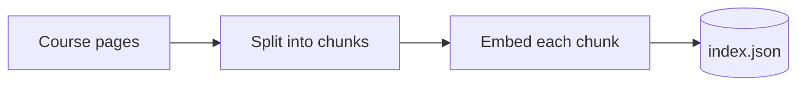
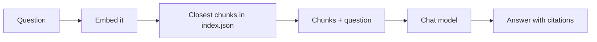
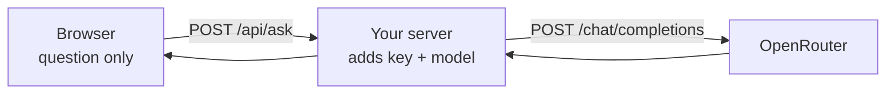

<style src="./style.css"></style>

<div class="kicker">Trinity College · October 5, 2026</div>

# AI Integration

<div class="big">Retrieval-augmented generation, and the plan</div>

Ken Kousen · CPSC 415<br>Monday 1:30–4:10 · MC-225

<!--
1:30. Desk source switcher. Recording on (Zoom and Wispr). Due today: Week 3
repo + tag, portfolio intent+spec (tag intent-spec), team intent for TP1.
-->

---

# Where we are

<div class="two">
<div>

## Last week

Your program asked for data<br>Five cases said whether it worked<br>You wrote the spec before code

</div>
<div>

## This week

Your program answers from documents<br>Five questions, with and without them<br>You approve a plan before code<br>The key moves to a server

</div>
</div>

<div class="statement">A spec, reviewed and corrected: kousen/cpsc415-week02, commit "Approve spec".</div>

<!--
1:30–1:40. Show the Approve spec commit: Haiku wrote it, Opus reviewed it
against the intent, then the comparison and token counts were measured, not
guessed. Teams: confirm the four. Seats: Patrick's invitation.
-->

---

# REST in one page

| Verb | Means | Repeat safely? |
|---|---|---|
| `GET` | read | yes |
| `POST` | create, or run an action | no |
| `PUT` / `PATCH` | replace / change part | `PUT` yes |
| `DELETE` | remove | yes |

- A URL names a thing; the verb says what to do.
- **Stateless:** every request carries the key and the whole conversation.
- AI APIs are almost all `POST`: every call is a computation you pay for.

<div class="note">Handout: weeks/04/rest.md</div>

<!--
1:40–1:55. The promise from last week. Idempotent = same state after one or
many. Status codes on the handout: 400 is usually a model-name typo, 402 is
credit, 429 is slow down, 5xx is them.
-->

---

# The problem RAG solves

- The model knows its training data and whatever is in the prompt. Nothing else.
- Your documents are private, new, or too long to paste in every time.
- So at question time, send only **the few pieces that matter**.

<div class="statement">Retrieve the relevant chunks. Put them in the prompt. Generate the answer.</div>

<div class="note">Video: youtu.be/3kMwv7Kraxk · code: github.com/kousen/ragdemo</div>

<!--
1:55–2:00. Recap of the video: same six steps in LangChain, LangChain4j,
Spring AI. The demo builds the steps by hand to show them. From this week,
libraries and build tools are allowed: a framework is fine in the lab, as long
as the program prints the chunks it retrieved and their scores.
-->

---

# Two phases

**Once, and again whenever the pages change**



**For each question**



<div class="note">Frameworks call a chunk a segment, and the index an embedding store or vector store.</div>

<!--
2:00–2:05. Top row runs once (and again when documents change). Bottom row
runs per question. The same embedding model must be used in both rows.
-->

---

# What an embedding is

- A list of numbers for a piece of text: 1,536 of them for `text-embedding-3-small`.
- Texts that mean similar things point in similar directions.
- **Cosine similarity** measures the angle: 1.0 is the same direction.

```python
def norm(v):
    return math.sqrt(sum(x * x for x in v))

def cosine(a, b):
    return sum(x * y for x, y in zip(a, b)) / (norm(a) * norm(b))
```

<div class="note">Some tools report similarity (higher is closer), some report distance (lower is closer). Same idea.</div>

<!--
2:05–2:08. The 2D picture from the video: fruits cluster, cities cluster.
Real embeddings have 1,536 dimensions; the math is the same four lines.
-->

---

# Live: index the course

```bash
python3 rag_index.py ../../../ai-integration-course
# 135 chunks, 21,501 tokens embedded -> index.json
```

- Chunks are Markdown sections, split at headings.
- Each chunk starts with its file and heading: `[weeks/03/lab.md › 4. The second model]`.
- The whole course costs about **$0.0004** to embed.

<!--
2:08–2:12. The file and heading on every chunk is metadata. The video's
point: much of RAG's success or failure is metadata. Hold that thought for
the stale-page demo.
-->

---

# Live: ask it

```bash
python3 rag_ask.py "When is the Week 3 lab due?"
```

- The four closest chunks go into the prompt, numbered.
- The system prompt: answer **only** from the excerpts, cite them, otherwise say *"I can't find that in the course documents."*
- The scores printed under the answer show why each chunk was chosen.

<!--
2:12–2:15. Same system-prompt idea as Spring AI's QuestionAnswerAdvisor in the
video: "if the answer is not in the context, say you can't answer."
-->

---

# Five questions, with and without retrieval

| # | Question | There to catch |
|---|---|---|
| 1 | When is the Week 3 lab due? | a fact in one place |
| 2 | Team Project 2's share of the grade? | a number a model could guess |
| 3 | What if I submit late? | a policy across sections |
| 4 | Week 3's second model? | a detail that changed |
| 5 | The campus parking policy? | not in the documents |

<div class="statement">With retrieval: 5/5. Without: 1/5, and the one it "passed" was the refusal.</div>

<!--
2:15–2:20. Run rag_eval.py, then RAG_K=0. In rehearsal, without retrieval
M3 and local Gemma both said they don't have the syllabus: no fabrication.
The point of RAG here is access, not stopping hallucination.
-->

---

# When RAG hurts: a stale page

```text
Which Xiaomi MiMo model does this course use
as the fallback or second model?
```

- Retrieval finds **both** pages: Week 3's lab (`mimo-v2.6-flash`) and Week 1's setup (`mimo-v2.5`).
- The model answers `mimo-v2.5`, faithfully cited, and **out of date**.
- The pages disagree, and nothing in a chunk says which is newer.

<div class="statement">RAG is only as current as its documents. Add a current page and the answer changes.</div>

<!--
2:20–2:25. Live, twice: index without weeks/04 (stale answer), then with it
(the Week 4 lab page explains the change and the answer is corrected). Fixes: date metadata on each chunk and "prefer the newest";
curate and update the corpus; re-index when documents change. The portfolio
chatbot has the same problem with your own profile.
-->

---

# Chain stage 3: the plan

| Stage | Artifact | Written by | Approved by |
|---|---|---|---|
| Plan | `intent/*.md` | agent, after interviewing you | you |
| Design | `spec.md` | agent, from the intent | you, against the intent |
| **Build** | **`plan.md`, then code** | **agent** | **you, before any code** |

- **Files** to create or change, and why.
- **Order** of work.
- **Risks:** what could break, the assumption behind each step, the blast radius.
- **Proof:** how you will know each step worked.

<!--
2:25–2:30. Open the template plan.md. "Approved by" is at the bottom, and the
commit history must show the plan committed before the first code.
-->

---

# Interrogate the plan

- "What could break in step 3, and how would I notice?"
- "How big is a chunk, and why that size?"
- "What does the proof step run, and what output means it worked?"
- "What happens when two documents disagree?"

<div class="statement">A plan you haven't questioned is the agent's plan, not yours.</div>

<!--
2:30–2:35. Live if time: ask the agent to plan the ask-the-course bot, then
ask two of these. Correct the plan in the file. The last question is the
stale-page demo again.
-->

---

# Parallel work and blast radius

- **Subagents** work in their own context window: "summarize this repo," "find the auth code."
- **Git worktrees** give each parallel task its own checkout, so two agents don't edit the same files.
- **Permissions** decide what an agent may do without asking. Wider permissions, bigger blast radius.
- Subagents inherit your model and cost tokens in parallel. Name a cheaper model for them.

<!--
2:35–2:45. The plan template has a "Subagents and parallel work" section:
say which and why, or "none." Nothing in this week's lab needs parallel work.
BREAK after this slide.
-->

---

# The key stays on the server



- A key in a web page is a key anyone can copy: view source, network tab.
- Team Project 1 needs a server **even on your laptop**.
- `examples/key-on-server/`: the same page and contract in Python and Java. A web framework does the same job with less code.

<!--
2:55–3:00. Run server.py, then java Server.java. View source: no key. Network
tab: only /api/ask. The server also picks the model, so a visitor can't
choose Fable on your bill.
-->

---

# Other ways to hold the key

| Option | The key lives in |
|---|---|
| Your own server (today's example) | an environment variable on the server |
| Cloudflare Pages Functions / Workers | a Cloudflare secret |
| Vercel Functions | a Vercel environment variable |
| here.now proxy routes | a here.now service variable |

- All have agent skills; the agent can deploy. **You** check the key isn't in the browser.
- Public means anyone can call it: add a password or rate limit, and a key with a credit limit.

<!--
3:00–3:10. Deployment comes after Trinity Days. For the Nov 2 presentation,
localhost is fine. Put the server in your TP1 plan now.
-->

---

# Lab: ask the course

<div class="two">
<div>

<span class="step">0</span> Template repo, `CLAUDE.md` lines<br>
<span class="step">1</span> Intent and spec, briefly<br>
<span class="step">2</span> **The plan**, questioned

</div>
<div>

<span class="step">3</span> Build from the plan; five questions<br>
<span class="step">4</span> A stale page<br>
<span class="step">5</span> Explain and save

</div>
</div>

<div class="note">weeks/04/lab.md · 45 minutes · Prof. Kousen circulates</div>

<!--
3:10–3:55. Numbers match the lab this week (0–5). Protect steps 1–3. If time
runs short, step 4 becomes a sentence in the README.
-->

---

# Save evidence of the work

```bash
git add .
git commit -m "Ask-the-course bot with five-question eval"
git tag week04-submitted
git push -u origin main
git push origin week04-submitted
```

`plan.md` approved **before** the first code commit. `CHECKS.md`: with and without retrieval, and the stale page.

<!--
3:55–4:00.
-->

---

# Before October 19

- **No class October 12** (Trinity Days).
- **October 19, 1:30:** the Week 4 submission; Team Project 1 `spec.md` and `plan.md`.
- Put the server in your TP1 plan.
- Week 5: vision models, and the Test stage.

<!--
4:00–4:05. Two weeks to the next deadline. Say it twice.
-->

---

# Before you leave

- What does an embedding let you compare?
- Why tell the model to say "I can't find that"?
- What should you ask a plan before you approve it?

<!--
4:05–4:10. Answered aloud.
-->

---

# Sources and next steps

<div class="small">

- Ken Kousen, [Retrieval-Augmented Generation](https://youtu.be/3kMwv7Kraxk) (video) and [kousen/ragdemo](https://github.com/kousen/ragdemo): LangChain, LangChain4j, Spring AI.
- [OpenRouter embeddings](https://openrouter.ai/docs/api/reference/embeddings) · [Artifact-chain template](https://github.com/kousen/artifact-chain-template): `plan.md`.
- [The AI-Native SDLC Playbook](https://claude.com/blog/the-ai-native-sdlc-playbook): the Build stage.
- Roy Fielding, *Architectural Styles and the Design of Network-based Software Architectures* (2000): REST.
- Reference RAG code and the server examples rehearsed September 28 on `minimax/minimax-m3` with `openai/text-embedding-3-small`.

</div>

<p class="note">Prepared September 28, 2026.</p>
